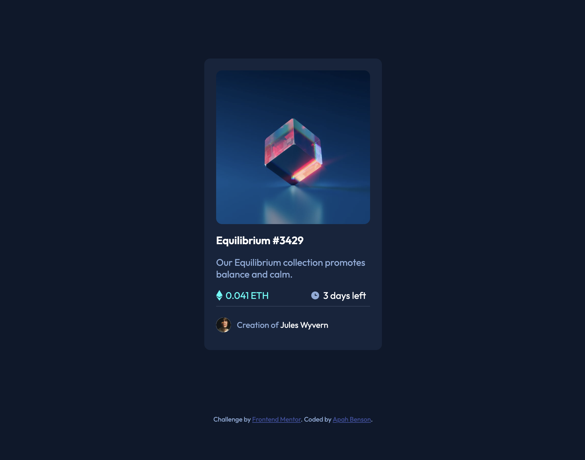

# Frontend Mentor - NFT preview card component solution

This is a solution to the [NFT preview card component challenge on Frontend Mentor](https://www.frontendmentor.io/challenges/nft-preview-card-component-SbdUL_w0U). Frontend Mentor challenges help you improve your coding skills by building realistic projects.

## Table of contents

- [Overview](#overview)
  - [The challenge](#the-challenge)
  - [Screenshot](#screenshot)
  - [Links](#links)
- [My process](#my-process)
  - [Built with](#built-with)
  - [What I learned](#what-i-learned)
  - [Continued development](#continued-development)
- [Author](#author)

## Overview

### The challenge

Users should be able to:

- View the optimal layout depending on their device's screen size
- See hover states for interactive elements

### Screenshot



### Links

- Solution URL: [Add solution URL here](https://github.com/apah-dev/nft-preview-card-component-main.git)
- Live Site URL: [Add live site URL here](https://apah-dev.github.io/nft-preview-card-component-main/)

## My process

### Built with

- Semantic HTML5 markup
- CSS custom properties
- Flexbox

### What I learned

Learnt how to use use the nth-of-type to target a specific child in a list of items in a parent element
Using hover for the active states

````css

      .price > img:nth-of-type(2) {
        margin-left: 70px;
      }

      .price > span:nth-of-type(2) {
        margin-left: 5px;
        color: var(--White);
        align-self: flex-end;
      }

      .price > p:nth-of-type(1) {
        color: var(--Cyan);
      }

      .price > p:nth-of-type(2) {
        color: var(--Softblue);
      }

```


## Author

- Frontend Mentor - [@apah-dev](https://www.frontendmentor.io/profile/apah-dev)
- Twitter - [@benson_apah](https://www.twitter.com/benson_apah)
````
